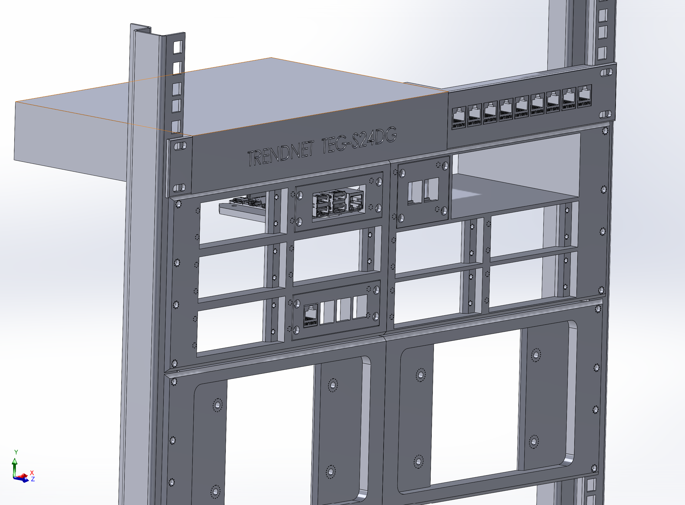

# Custom Designed and Built Rackmount Items

## 3U Raspberry Pi 7-Inch Touch Screen Holder
- Designed to fit half of a 19" rack.
- Securely holds a Raspberry Pi with a 7-inch touchscreen display.
- Ideal for compact and organized setups in a rack environment.

## 3U Rackmount Raspberry Pi Holder
- Features **six slots** to accommodate:
  - Up to **six Raspberry Pis**.
  - A **custom-designed keystone RJ45 holder** with **five Raspberry Pis**.
  - Any desired combination of Raspberry Pis and keystone modules.

## 3U Rackmount for Advantech PoE Switch & Raspberry Pis
- Houses an **Advantech PoE switch**.
- Includes a **2-port keystone holder**.
- Provides space for **four Raspberry Pis**.
- Optimized for efficient networking and computing in a compact 3U space.

## Custom Patch Panel for TRENDnet TEG-S24DG Switch
- Specifically designed to complement the **TRENDnet TEG-S24DG switch**.
- Converts the switch into a **1U rackmount switch patch panel**.
- Enhances cable management and accessibility in rack installations.

These designs ensure efficient utilization of rack space, improved cable management, and seamless integration of Raspberry Pis and networking equipment.

