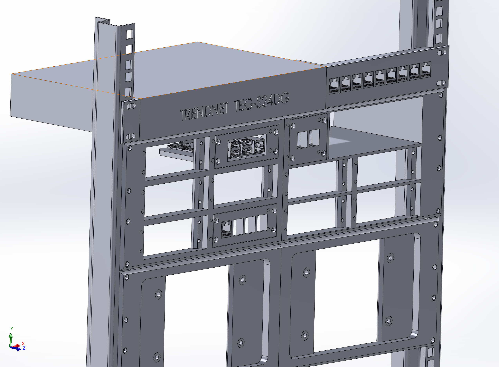

# Custom Rackmount Hardware

Custom parts designed for this homelab rack and 3D-printed for deployment.

## 3U Raspberry Pi 7-inch touchscreen holder

- Half-width 19-inch rack fit.
- Holds one Raspberry Pi with official 7-inch touchscreen.
- Intended as a local control panel in-rack.

## 3U Raspberry Pi multi-holder

- Six-slot design.
- Supports all-Pi layout or mixed Pi + keystone layout.
- Keystone option includes custom RJ45 holder variant.

## 3U holder for Advantech PoE switch + Raspberry Pis

- Fits Advantech PoE switch.
- Includes 2-port keystone holder section.
- Additional space for up to four Raspberry Pis.

## 1U patch panel for TRENDnet TEG-S24DG

- Custom panel matched to switch footprint.
- Improves cable routing and front-of-rack accessibility.

## Notes

- CAD sources and STLs are kept in this folder hierarchy.
- Final print settings and material notes should be documented per model.
